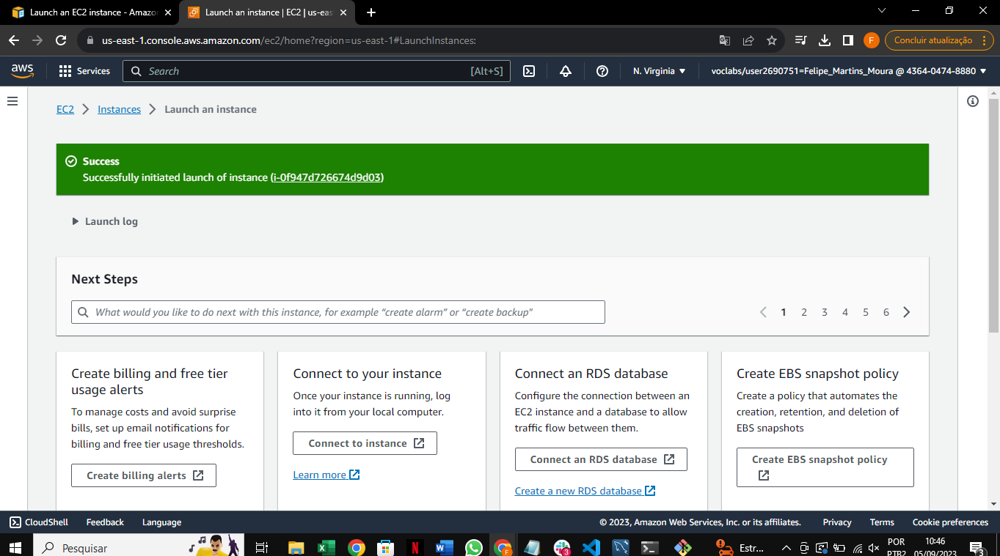
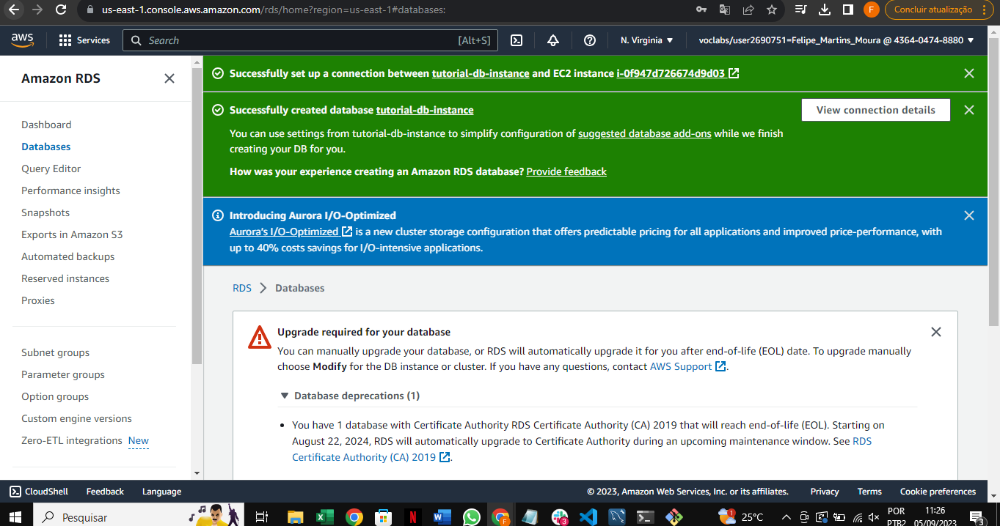
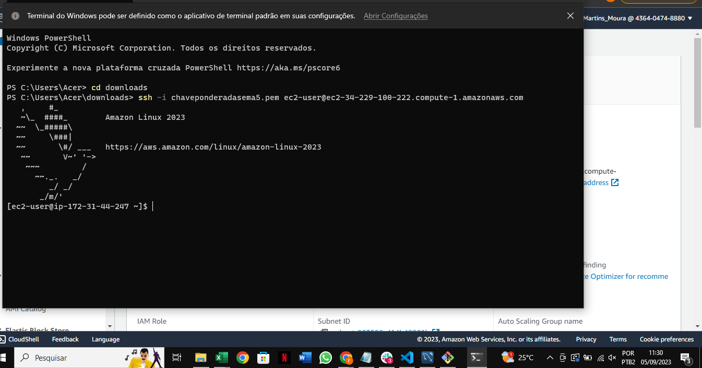
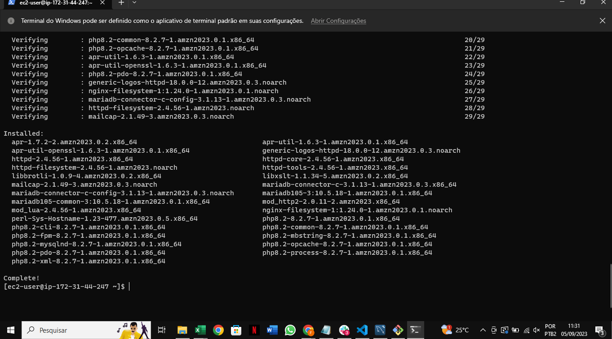
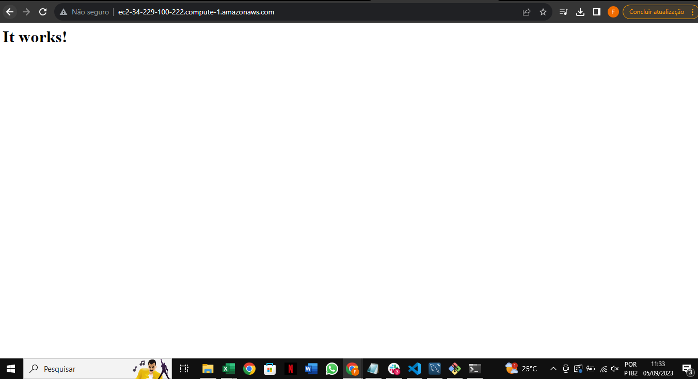
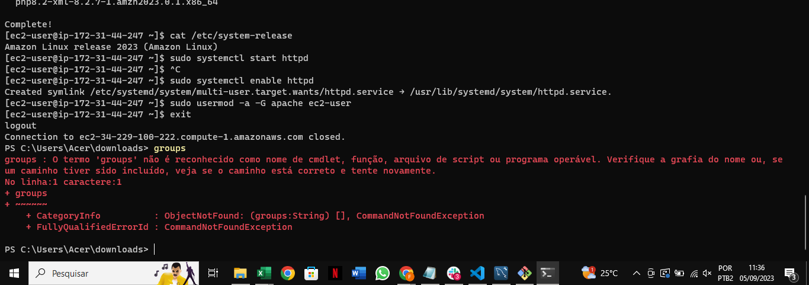
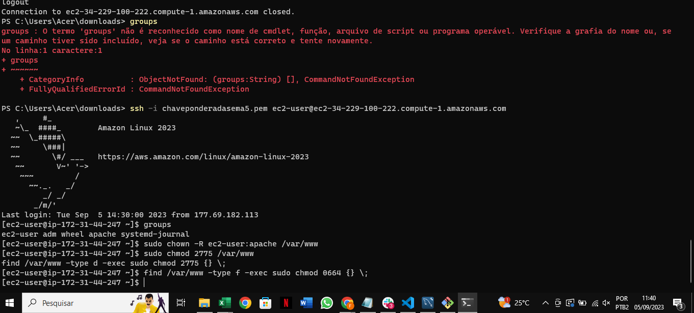
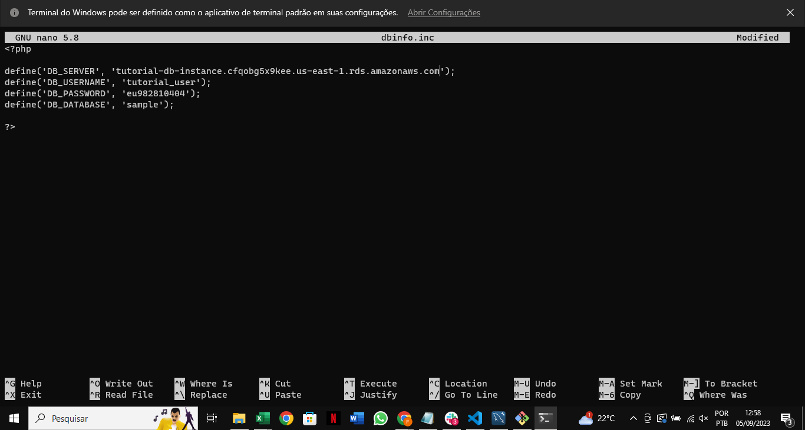

# AtividadePonderadaSemana5

# Aplicação Web com Banco de Dados Integrado

Este repositório contém o código desenvolvido para uma aplicação web simples que interage com um banco de dados. O projeto foi desenvolvido seguindo o tutorial fornecido como parte de uma tarefa de autoestudo.

## Características

- Aplicação web para interação com o banco de dados.
- Uso de duas tabelas, sendo uma delas criada como parte das instruções específicas da tarefa, contendo 4 campos e 3 tipos de dados diferentes.
- Página web para criar e listar registros da tabela mencionada.
- Demonstração de deploy e execução no console da AWS.

## Instruções

1. **Setup da Aplicação**: O primeiro passo foi configurar e preparar a aplicação seguindo o tutorial https://docs.aws.amazon.com/AmazonRDS/latest/UserGuide/TUT_WebAppWithRDS.html.

Os principais passos realizados são demonstrado nos prints a seguir:

*Criaçao Instância EC2*
 

*Criação Database*

*Iniciando Conexão SSH*

*Instalando Apache Web Server*

*Iniciando Web Server

*Outras Etapas de Configuração"

*Outras Etapas de Configuração"

*Configurando DB.INFO"

Após a configuração é necessário alterar o codigo para atender as demandas solicitadas, que estão nesse diretório no arquivo: "codigo.php".

2. **Criação da Tabela Adicional**: Uma tabela adicional foi criada com os seguintes campos:
    - `name` (Tipo: varchar)
    - `age` (Tipo: int)
    - `rate` (Tipo: decimal)
    - `course` (Tipo: varchar)
3. **Página de Interação**: Uma página foi desenvolvida para permitir a criação e listagem dos registros da tabela criada.
4. **Deploy na AWS**: A aplicação foi implantada na AWS, e os detalhes do deploy, bem como a explicação das máquinas/serviços utilizados, podem ser visualizados no vídeo de demonstração abaixo.

## Vídeo de Demonstração

Assista à demonstração completa das máquinas/serviços em execução no console da AWS, onde explico o processo de deploy e descrevo as funcionalidades de cada máquina/serviço: [<video src="Instance%20details%20_%20EC2%20_%20us-east-1%20-%20Google%20Chrome%202023-09-06%2023-12-04.mp4" controls title="Link do Vídeo"></video>].
<video 

